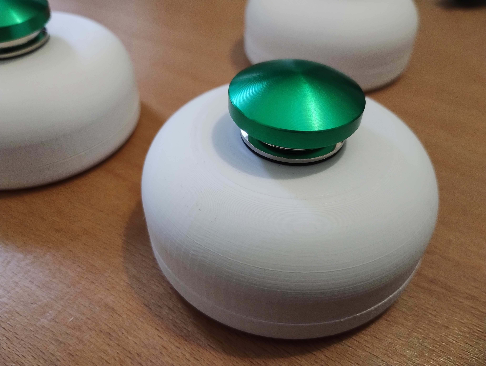

# Making the Boost Button

| Instructions | Picture |
| ------------ | ------- |
| Firstly, take one of the keyfind fobs... |  |
| ...and open it up. You can prize the two parts of the case apart, perhaps by inserting a small screwdriver in between them around the lanyard loop.|  |
| Take the circuit board and desolder the battery connectors. |  |
| Take the top part of the hockey puck box... |  |
| Fit the mushroom button into the box. |  |
| ...and tighten the retaining nut as far as possible. You may want to use a small screwdriver to rotate the nut, whilst pushing the button into the box to compress the rubber seals. |  |
| Insert the beacon board in the inside of the case. |  |
| Next, insert one of the two battery holders and screw it into place. Cut the black (negative) wire and solder it to the beacon board. Cut and join the red wire and the black wire of the second battery holder together. |  |
| Mount the second battery holder and screw it into place. This will secure the beacon board into place. Cut the red wire and screw it into one of the switch terminals. |  |
| Solder some wire to the battery terminal on the beacon board and screw the other end into the second switch terminal. Finally, screw the bottom of the hockey puck to the top using four small screws. |  |
| The boost button is now complete. |  |
