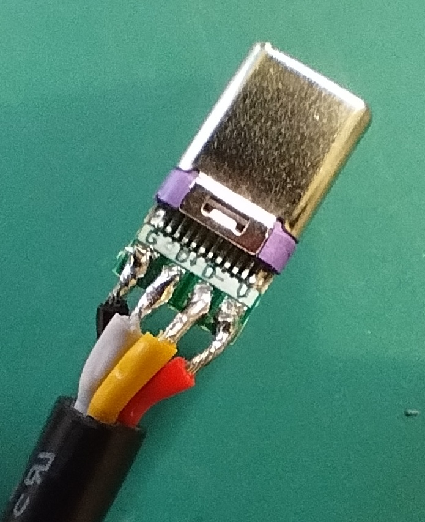
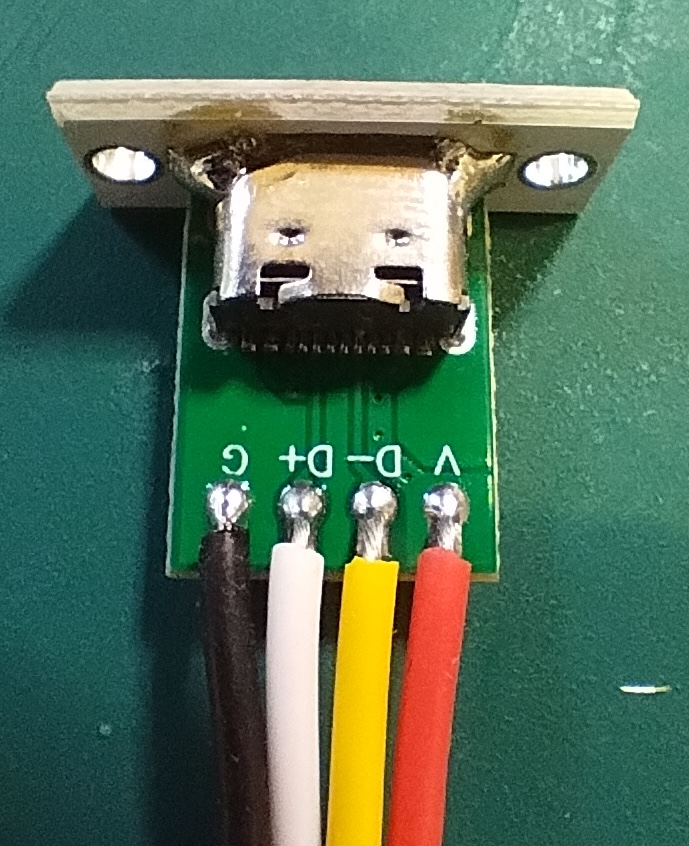
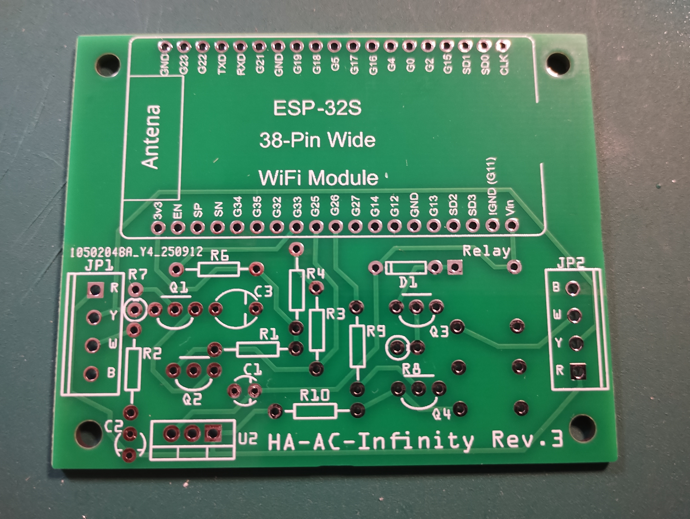
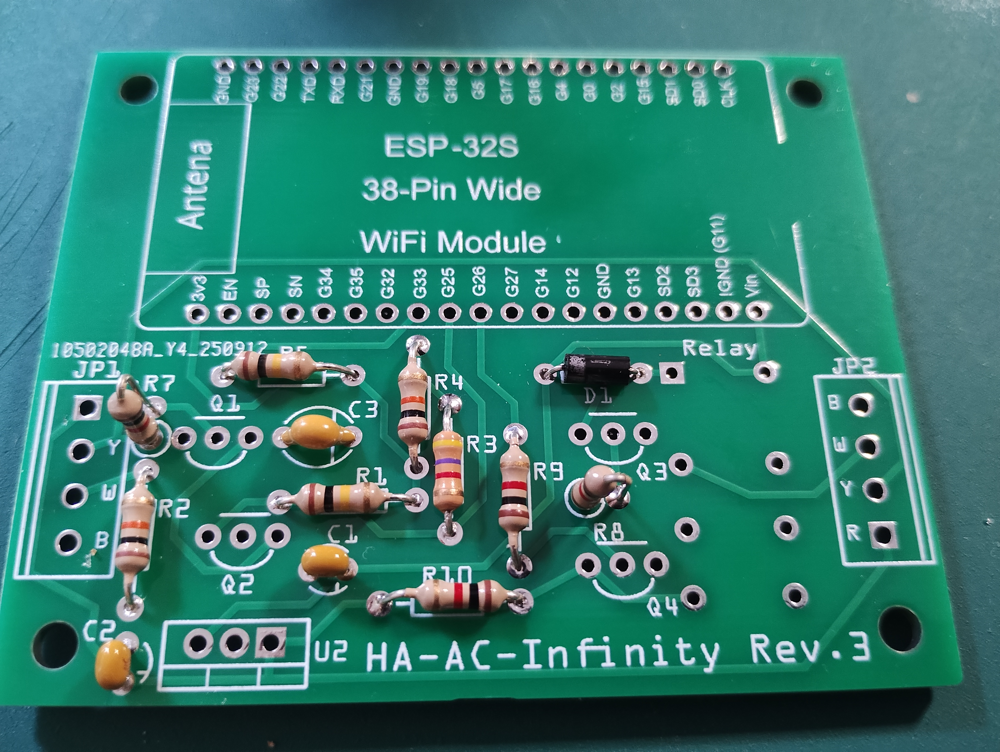
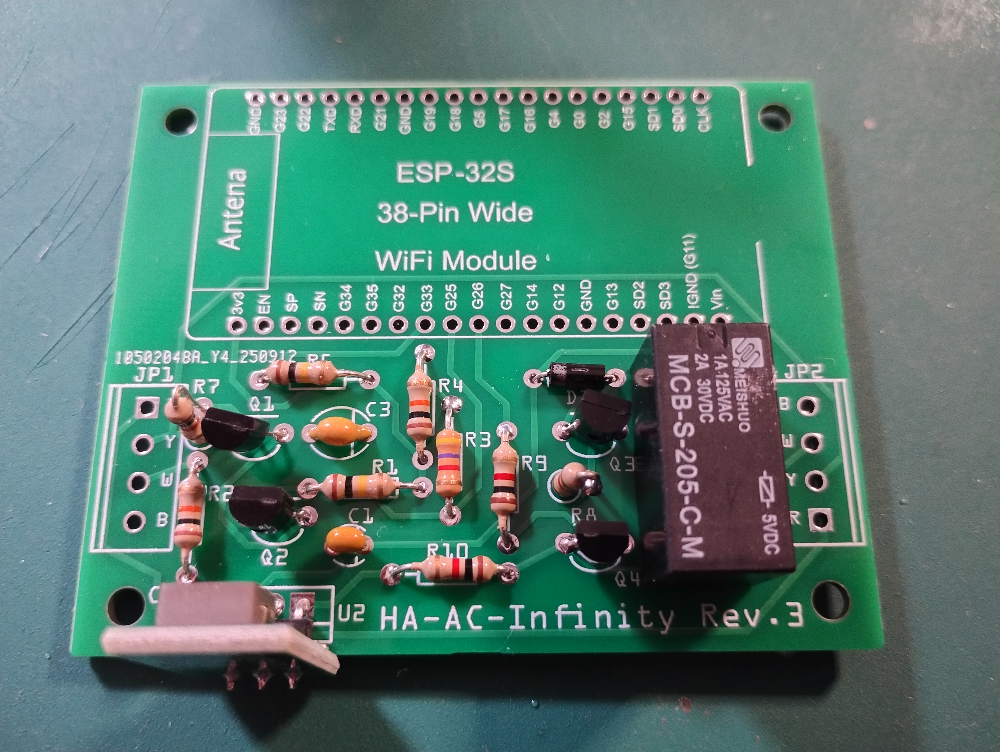
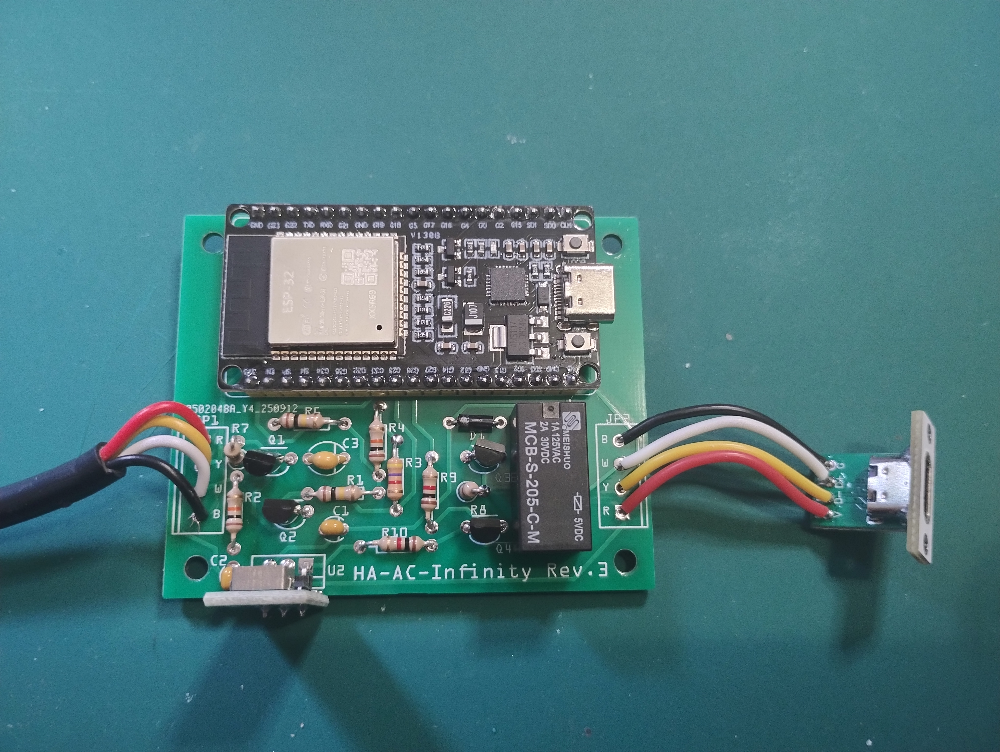
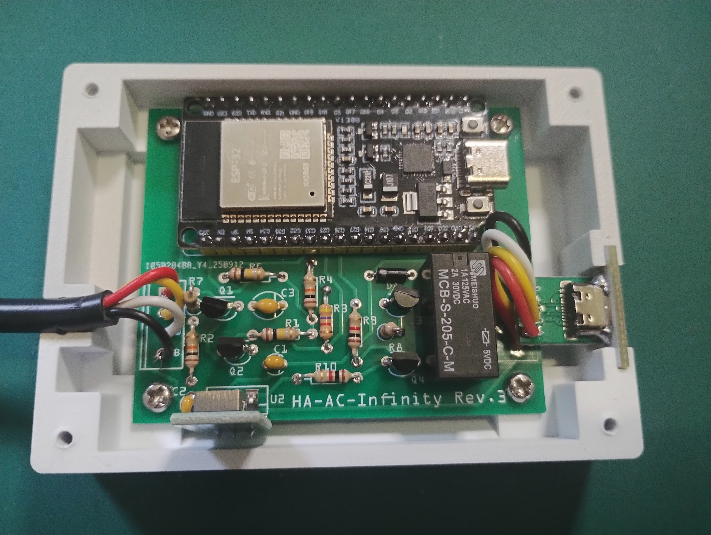

# HA AC Infinity Electronics

The electronics for the HA AC Infinity project require a few components:

- An ESP32-32S WROOM board (eg. https://www.amazon.co.uk/dp/B0DQ51N5B1)
- A USB-C socket (eg. https://www.amazon.co.uk/dp/B0D59Y34ZF)
- A USB-C plug (eg. https://www.amazon.co.uk/dp/B09V273Z8Z)
- Some 4-core wire (eg. https://www.amazon.co.uk/dp/B0C14L4W14)
- Two 3D printed parts to make the box (although other boxes are also possible)
- Four M3 x 5mm and 4 M3 x 12mm screws to hold it together
- Some short lengths of general purpose multi-strand hookup wire (ideally in a few different colours)

There is also a whole [Bill Of Materials](ac-infinity-esphome_bom.html) (BOM) for the electronic circuit. The circuit uses mostly generic, easy to source through-hole components. It's relatively easy to solder together. The transistors I used are 2N3904, and I used a buck module (https://www.amazon.co.uk/dp/B081JMJZG6) instead of a regular 7805 voltage regulator (if you do use a 7805, you will also need a heatsink). The relay is a generic 5V coil, DPDT (I had some of these already). The BOM lists JP1 and JP2, but these are not needed - they're just holes for attaching wires.

I also had PCBs made, which is optional but recommended (you get a lot of electrical noise in this circuit, so trying to make it work on a breadboard or stripboard is likely to be difficult). There is a [Fritzing file](ac-infinity-esphome.fzz) and [exported Gerber files](ha-ac-infinity-gerber-export/) available if you want to make a PCB.

## Making the Electronics

### USB Connectors

AC Infinity misuse USB connectors for their proprietary connections. Their system is absolutely not compatible with any genuine USB devices, and will likely catastrophically damage them if you are foolish enough to connect them to it.

For the project, we need a lead with a plug on the end of it and a socket. The plug likely can't fit any plastic covers on it, and the lead should be long enough to allow you to put the box of electronics somewhere near to the fan's controller. In my case they're all hidden away, so I've used a short cable. Longer cables are likely possible because the signals used aren't particularly complex.

| Socket & Plug | AC Infinity | Colour Coding |
| ------------- | ----------- | ------------- |
| V             | +10V        | Red           |
| D+            | Tach Signal | Yellow        |
| D-            | PWM         | White         |
| G             | Ground      | Black         |

Note the labelling on the plug and socket is really small - be careful where you're soldering!

For the plug, cut about 30cm of the four core cable. Remove about 15mm of sleeve from one end to expose the individual wires. Then strip all four wires to a couple of millimeters (I found it easier to strip to about 5mm and trim them after tinning). Tin the ends, and tin all four pads on the plug. Then you can connect the wires to the pads relatively easily. At the other end of the cable, remove maybe 15-20mm of sleeve and then strip the wires to about 5mm (don't tin them though).

For the socket, you need four 50mm lengths of multi-strand wire. Strip one end to a couple of millimeters, insert into the holes on the socket and solder into place. Again, strip the other end to maybe 5mm, but don't tin them.

| USB Plug Wiring                                                                      | USB Socket Wiring                                                                        |
| ------------------------------------------------------------------------------------ | ---------------------------------------------------------------------------------------- |
|  |  |

### Making the PCB

The PCB uses through-hole components, which are hopefully easy to fit and solder. Most components lie against the board, although a few resistors are vertical (R7 & R8). Please note that if a 7805 voltage regulator is used (instead of a compatible module) then a heat sink will be required.

See the [Bill Of Materials](ac-infinity-esphome_bom.html) for a full list of components required and where to fit them. Note that JP1 and JP2 are not required - instead their holes can be used to connect wires from the USB sockets (see below).

| Step                                                                                       | Step                          |
| ------------------------------------------------------------------------------------------ | ----------------------------- |
|                | Start with an empty board...  |
|  | Add the passive components... |
|    | Add the active components...  |

### Connecting the USB Connectors

The left hand JP1 connector is used to connect the USB plug, on the 4 core cable. The right hand, JP2 connector is used to connect the USB socket, on four short multi-strand wires. Note the colour coding of the holes on the PCB, from the top of the board to the bottom:

| JP1    | JP2    |
| ------ | ------ |
| Red    | Black  |
| Yellow | White  |
| White  | Yellow |
| Black  | Red    |

Once assesmbled it should look like this:

### Fitting the board into the box

The board should screw into the box using four M3 5mm self-tapping screws. The 4 core cable should fit into the cable gland, and be held into place by a strain-relief grip. The USB socket should fit into the slot on the side of the box.

